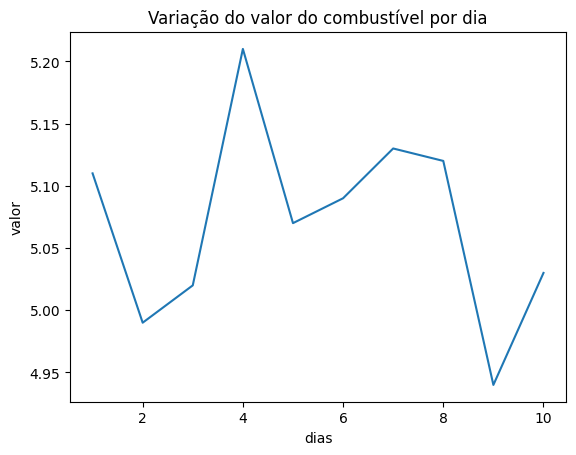

# da-ebac

# Módulo 18 - Editando o repositório!

> Neste módulo aprendemos a utilizar alguns comandos git como visualizar, reverter e salvar alterações. Algumas das operações realizadas foram:
Criar um arquivo com o nome gasolina.csv que contém todas as informações que serão utilizadas para a geração do gráfico. Criação de um outro arquivo com o comando !touch nome-do-arquivo, agora com o nome de gasolina.py, para salvar dentro dela os trechos de código e por fim, um outro arquivo com o nome de gasolina.png com a imagem em si.

Após esse processo, realizamos o !git add para salvar as alteraçõs, e o !git commit para salvá-las.

Segue abaixo o gráfico para uma melhor análise do que foi proposto:

